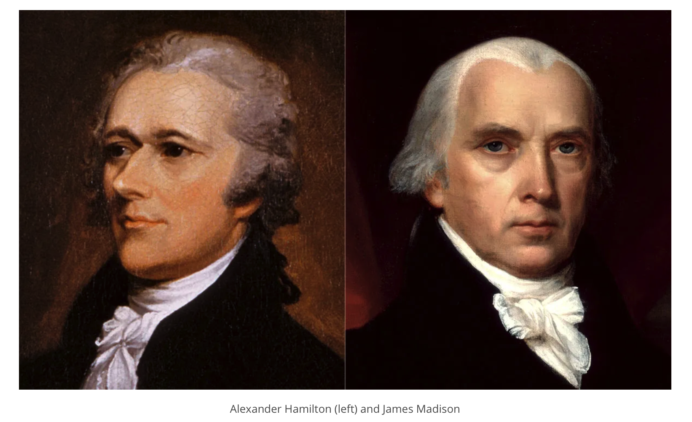

# Bayesian Statistics

Course [home page](./)

See also: [Daily Schedule Term 3](./daily_schedule_term_3.html)

## Daily Schedule Term 2

### Week 1 &mdash; Uncertainty, Fractional Error, Propagation of Error, and Random Variables &mdash; Mean

* Tuesday, Aug. 27 &mdash; [Syllabus](./BayesianStatisticsSyllabus.pdf) &mdash; Study pp. 4-15 of Young &mdash; Change in volume of a cylinder due to change in radius &mdash; The formula for the mean (aka average) &mdash; The bar notation for the mean &mdash; The formula for a &ldquo;weighted&rdquo; mean (in case you have more faith in some of the contributions to the average, you can weight those contributions more) &mdash; The &Sigma; summation notation &mdash; The formula for &sigma;&sup2; where &sigma; is the &ldquo;standard deviation of the mean&ldquo; &mdash; Contrasting standard deviation (which uses squares of differences) with the average of the absolute differences
* Friday, Aug. 30 &mdash; Carefully read pp. 1-15 of Young &mdash; Do the [Assignment for Friday](./assignments/AssignmentFor2024-08-30.nb.pdf) &mdash; Come prepared with any remaining questions about pp. 1-15 &mdash; Let's give some classic examples of and define, what is a &ldquo;random variable?&ldquo; &mdash; A coin toss (repeated) &mdash; A toss of a handful of coins (repeated) &mdash; Let's define, what is a  &ldquo;statistic?&rdquo; &mdash; Galton's box (and its relation to coin tosses) &mdash; Combinatorics (which is essentially the study of how many ways there are of arriving at the same result) &mdash; Pascal's triangle &mdash; The choose notation &mdash; The factorial notation and its application to combinatoric formulae

### Week 2 &mdash; Combinatorics and Probability Distributions &mdash; Binomial Distribution &mdash; Variance

* Tuesday, Sept. 3 &mdash; Carefully read to p. 35 of Young (the end of Chapter 2) &mdash; Come prepared with any remaining questions about pp. 16-35 &mdash; Do the [Assignment for Tuesday](./assignments/AssignmentFor2024-09-03.nb.pdf)
* Friday, Sept. 6 &mdash; Carefully read to p. 57 of Young (stop just before he starts the Poisson distribution) &mdash; Come prepared with any remaining questions about pp. 39-57 &mdash; Do the [Assignment for Friday](./assignments/AssignmentFor2024-09-06.nb.pdf) &mdash; The relation between small changes, &ldquo;infinitesimal calculus,&rdquo; and partial derivatives (I finally explain equations 2.7, 2.8, and 2.9 on p. 7) &mdash; The relation of the Poisson distribution to the binomial distribution (the tricky derivation on p. 59)

### Week 3 &mdash; Poisson Distribution &mdash; Histograms, Integrals, and Cumulative Distribution Functions

* Tuesday, Sept. 10 &mdash; Carefully read to p. 64 of Young (the Poisson distribution) &mdash; Do the [Assignment for Tuesday](./assignments/AssignmentFor2024-09-10.nb.pdf) &mdash; Histograms and Integrals &mdash; Discussion of Histogram, Probability Distribution Functions (PDFs), and Cumulative Distribution Functions (CDFs), using deaths of males aged 0-109 as our example
* Friday, Sept 13 &mdash; To give everyone a break (especially me), there is no assignment due for Friday &mdash; Please use this time *to get started* on pp. 64-75 of Young, *but stop in that reading* as soon as you hit something that you really don't yet have the tools to understand, and come prepared with questions about the reading at the point that you decided to stop &mdash; Figures like Figure 9.2 on p. 68 should be starting to make sense given Tuesday's discussion

### Week 4 &mdash; Gaussian Distribution &mdash; Start Linear Regression

* Tuesday, Sept. 17 &mdash; You will be doing your last major topic in Young (the Gaussian distribution), pp. 64-75, which you already started on last week &mdash; Do the [Assignment for Tuesday](./assignments/AssignmentFor2024-09-17.nb.pdf) &mdash; Warmup for Linear Regression
* Friday, Sept. 20 &mdash; Finish Chapter 3 of Young (to the end of Section 11, p. 86) &mdash; Do the [Assignment for Friday](./assignments/AssignmentFor2024-09-20.nb.pdf)

### Week 5 &mdash; Exam 1 &mdash; Finish Linear Regression &mdash; Goodness of Fit

* Tuesday, Sept. 24 &mdash; [Exam 1](./exams/Exam1.nb.pdf) on Descriptive Statistics (covers Problem Sets 1-5 and Young Sections 1-9) &mdash; Problem Set 6, linear regression and the application of &chi;-squared will be on Exam 2
* Friday, Sept. 27 &mdash; Review Sections 10 and 11 of Young &mdash; Read Chapter 1 of [Bayesian Statistics for Beginners](https://www.amazon.com/Bayesian-Statistics-Beginners-step-step/dp/0198841299) &mdash; Do the [Assignment for Friday](./assignments/AssignmentFor2024-09-27.nb.pdf) (and use [this graph paper](./assignments/GraphPaperFor2024-09-27.nb.pdf) to graph the data and fit for Problem 1)  &mdash; Finish Discussion of Linear Regression and Goodness of Fit

NOTE: Now that we have covered the essential parts of the compact classic introduction to descriptive statistics by Young,
the material for much (but not all!) of the rest of the course will follow an introductory Bayesian statistics text: Therese Donovan and Ruth Mickey, [Bayesian Statistics for Beginners](https://www.amazon.com/Bayesian-Statistics-Beginners-step-step/dp/0198841299).

### Week 6 &mdash; Conditional, Marginal, and Joint Probabilities &mdash; Bayes Theorem

* Tuesday, Oct. 1 &mdash; Read Chapter 2 of *Bayesian Statistics for Beginners* &mdash; Do the [Assignment for Tuesday](./assignments/AssignmentFor2024-10-01.nb.pdf) &mdash; Probabilistic Notation &mdash; Venn Diagrams &mdash; False Positives &mdash; False Negatives
* Friday, Oct. 4 &mdash; Read Chapter 3 of *Bayesian Statistics for Beginners* &mdash; Do the [Assignment for Friday](./assignments/AssignmentFor2024-10-04.nb.pdf) &mdash; To make the reading more lively and to give us all some comic relief, Tahm has volunteered to open Friday's class with a 5-minute presentation on Morton's toe &mdash; Bayes Theorem &mdash; Compare Equation 3.23 with the frequentist lie that we used to get the linear regression formulas

### Week 7 &mdash; Bayesian Inference

* Tuesday, Oct. 8 &mdash; Read Chapter 4 of *Bayesian Statistics for Beginners*
* Friday, Oct. 11 &mdash; No class (first day of Term 2-3 break)

Continued on: [Daily Schedule Term 3](./daily_schedule_term_3.html)

