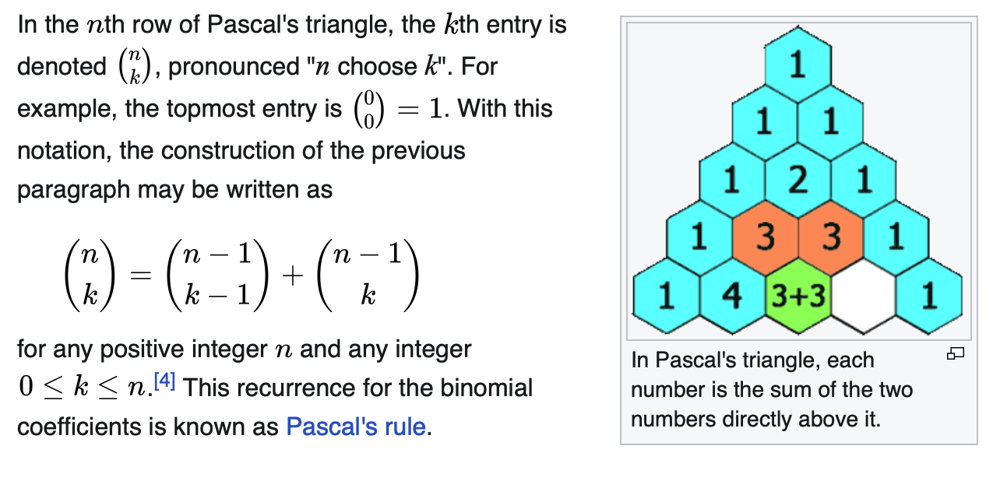

# Bayesian Statistics

Course [home page](./)

## Daily Schedule Term 2

### Week 1 &mdash; Uncertainty, Fractional Error, Propogation of Error and Random Variables &mdash; Mean

* Tuesday, Aug. 27 &mdash; [Syllabus](./BayesianStatisticsSyllabus.pdf) &mdash; Study pp. 4-15 of Young &mdash; Change in volume of a cylinder due to change in radius &mdash; The formula for the mean (aka average) &mdash; The bar notation for the mean &mdash; The formula for a &ldquo;weighted&rdquo; mean (in case you have more faith in some of the contributions to the average, you can weight those contributions more) &mdash; The &Sigma; summation notation &mdash; The formula for &sigma;&sup2; where &sigma; is the &ldquo;standard deviation of the mean&ldquo; &mdash; Contrasting standard deviation (which uses squares of differences) with the average of the absolute differences
* Friday, Aug. 30 &mdash; Carefully read pp. 1-15 of Young &mdash; Do the [Assignment for Friday](./assignments/AssignmentFor2024-08-30.nb.pdf) &mdash; Come prepared with any remaining questions about pp. 1-15 &mdash; Let's give some classic examples of and define, what is a &ldquo;random variable?&ldquo; &mdash; A coin toss (repeated) &mdash; A toss of a handful of coins (repeated) &mdash; Let's define, what is a  &ldquo;statistic?&rdquo; &mdash; Galton's box (and its relation to coin tosses) &mdash; Combinatorics (which is essentially the study of how many ways there are of arriving at the same result) &mdash; Pascal's triangle &mdash; The choose notation &mdash; The factorial notation and its application to combinatoric formulae

### Week 2 &mdash; Combinatorics and Probability Distributions &mdash; Binomial Distribution &mdash; Variance

* Tuesday, Sept. 3 &mdash; Carefully read to p. 35 of Young (the end of Chapter 2) &mdash; Come prepared with any remaining questions about pp. 16-35 &mdash; Do the [Assignment for Tuesday](./assignments/AssignmentFor2024-09-03.nb.pdf) &mdash; Copy all of Chapter 3 (pp. 38-91) of Young (a printout that you can copy from is across from the copier or you can easily find PDF scans of Young online)
* Friday, Sept. 6 &mdash; Carefully read to p. 57 of Young (stop just before he starts the Poisson distribution) &mdash; Come prepared with any remaining questions about pp. 39-57 &mdash; Do the [Assignment for Friday](./assignments/AssignmentFor2024-09-06.nb.pdf) &mdash; The relation of the Poisson distribution to the Binomial distribution

### Week 2 &mdash; Poisson Distribution &mdash; Gaussian Distribution

* Tuesday, Sept. 10 &mdash; Carefully read to p. 64 of Young (the Poisson distribution) &mdash; ASSIGNMENT COMING

