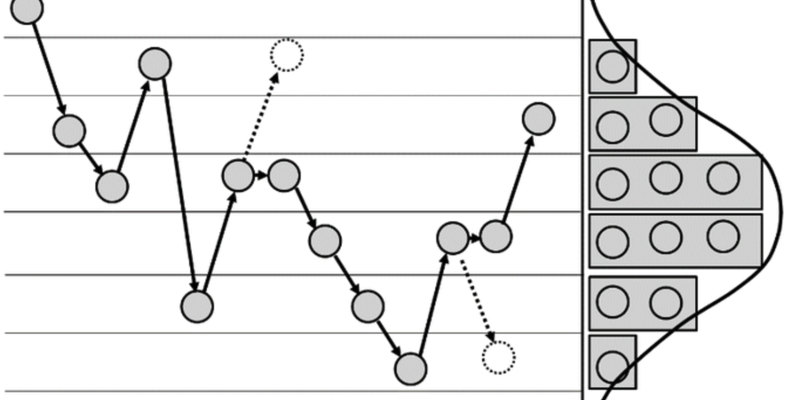

# Bayesian Statistics

Course [home page](./)

See also: [Daily Schedule Term 2](./daily_schedule_term_2.html)

## Daily Schedule Term 3

### Week 8 &mdash; Building Your Intuition with More Examples with Mutually-Exclusive Hypotheses: Hamilton vs. Madison and a Mudslide with Pollen

* Tuesday, Oct. 29 &mdash; Study Chapter 5 of *Bayesian Statistics for Beginners* &mdash; Do the [Assignment for Tuesday](./assignments/AssignmentFor2024-10-29.nb.pdf) &mdash; Preparatory discussion for Chapter 6
* Friday, Nov. 1 &mdash; Study Chapter 6 of *Bayesian Statistics for Beginners* &mdash; Do the [Assignment for Friday](./assignments/AssignmentFor2024-11-01.nb.pdf) &mdash; Preparatory discussion for Chapters 8 and 9: [A Continuum of Hypotheses](./resources/AContinuumOfHypotheses.pdf) &mdash; NOTE: We skipped Chapter 7 because it introduced too little that is new

### Week 9 &mdash; Bayesian Statistics with Probability Distributions 

* Tuesday, Nov. 5 &mdash; Dive in at the last half of Chapter 8, pp. 95-107 (if you also try to read pp. 88-94 of Chapter 8, I think you will find it to be a mind-numbing review of what we covered in Young) &mdash; Continue in Chapter 9, pp. 108-122 (this is yet more review of Young but in this case the review is useful) &mdash; Do the [Assignment for Tuesday](./assignments/AssignmentFor2024-11-05.nb.pdf) &mdash; We reviewed Bernoulli and Binomial Distributions, including the &ldquo;*n* choose *k*&rdquo; prefactor in the binomial distribution &mdash; We looked at the etymologty of the terms &ldquo;probability mass function (PMF)&rdquo; (an example of which is the Poisson distribution) as Donovan and Mickey use the term in Chapter 8, and &ldquo;probability density function (PDF)&rdquo; (an example of which is the Gaussian distribution) as Donovan and Mickey use the term in Chapter 9 &mdash; We started the [Assignment for Friday](./assignments/AssignmentFor2024-11-08.nb.pdf)
* Friday, Nov. 8 &mdash; Finish Chapter 9 and the [Assignment for Friday](./assignments/AssignmentFor2024-11-08.nb.pdf) &mdash; We are not starting any new material &mdash; Instead, let's consolidate &mdash; People asked for [additional practice problems](./exams/InterestingProblemsBeforeExam2.nb.pdf), which we started in class

### Week 10 &mdash; Exam 2 &mdash; Start Bayesian Conjugates

* Tuesday, Sept. 24 &mdash; [Exam 2](./exams/Exam2.nb.pdf) on Frequentist and Bayesian Statistics (covers Problem Sets 6 to 12 and Donovan and Mickey Chapters 1 to 9), including linear regression and the application of &chi;-squared
* Friday, Nov. 15 &mdash; Study Chapter 10 &mdash; Introduce Bayesian Conjugates &mdash; Please examine the [Assignment for Friday](./assignments/AssignmentFor2024-11-15.nb.pdf) which is not to be turned in &mdash; Instead it just contains ideas for how you could approach Chapter 10

### Week 11 &mdash; Finish Bayesian Conjugates &mdash; Start Monte Carlo, Simple Applications

* Tuesday, Nov. 19 &mdash; You can study Chapter 11, which introduces gamma functions which are conjugate to Poisson distributions, or alternatively, you can just study my handout on [Bayesian Conjugates](./resources/BayesianConjugates.nb.pdf) &mdash; Please come with questions about Chapters 11 or my summary in the handout of Chapter 11: [Bayesian Conjugates](./resources/BayesianConjugates.nb.pdf) &mdash; Do the [Assignment for Tuesday](./assignments/AssignmentFor2024-11-19.nb.pdf) &mdash; An Advanced Idea from Chapter 12: [A Multi-Dimensional Continuum of Hypotheses](./resources/AMultiDimensionalContinuumOfHypotheses.pdf) &mdash; For completeness, here are [Michael I. Jordan's Stat260 notes](./resources/MichaelJordanStat260Notes.pdf)
* Friday, Nov. 22 &mdash; While you are doing the [Assignment for Friday](./assignments/AssignmentFor2024-11-22.nb.pdf) on Chapter 11, I have been working on a [Monte Carlo Methods Introduction](./resources/MonteCarloMethodsIntroduction.nb.pdf) and on a [Monte Carlo Playground and Program](./resources/MonteCarloPlayground.nb.pdf) that we will use in class &mdash; Rather than you diving in to Chapter 13 already, wait until that for the next class, and instead start by reading [The Beginning of the Monte Carlo Method](./resources/TheBeginningOfTheMonteCarloMethod.pdf)

### Week 12 &mdash; Continue Monte Carlo, Simple Applications &mdash; The Metropolis Algorithm

* Tuesday, Nov. 26 &mdash; Study Chapter 13 &mdash; Do the [Assignment for Tuesday](./assignments/AssignmentFor2024-11-26.nb.pdf) &mdash; Look ahead to the remainder of the course &mdash; Describe the various Monte Carlo methods and the Hepatitis B vaccination study
* Friday, Nov. 29 &mdash; No class - Shakespeare Festival

### Week 13 &mdash; The Metropolis-Hastings Algorithm

* Tuesday, Dec. 3 &mdash; Study Chapter 15 to p. 235 on Metropolis-Hastings &mdash; 
* Friday, Dec. 6 &mdash; This is a good time to re-read Chapter 15 to p. 229  &mdash; More directions for Friday are in the [Assignment for Friday](./assignments/AssignmentFor2024-12-06.nb.pdf) &mdash; See also [Monte Carlo Methods - Why Do They Work? - Part II](./resources/MonteCarloMethodsWhyDoTheyWork-II.nb.pdf)

### Week 14 &mdash; The Gibbs Sampling Algorithm &mdash; Exam 3

* Tuesday, Dec. 10 &mdash; Our subject is Gibbs Sampling (the GS in BUGS), and I am *not* going to have you look at Donovan and Mickey Chapter 16, because they have obscured what is laughably simple &mdash; Instead, in class we'll go through my [Monte Carlo Methods - Why Do They Work? - Part III](./resources/MonteCarloMethodsWhyDoTheyWork-III.nb.pdf) (CURRENTLY A WORK IN PROGRESS) &mdash; More directions for Tuesday will be in the [Assignment for Tuesday - FORTHCOMING](./assignments/AssignmentFor2024-12-10.nb.pdf) 
* Friday, Dec. 13 &mdash; Exam 3

### Week 15 &mdash; A Realistic Application of Gibbs Sampling

* Tuesday, Dec. 17 &mdash; The Hepatitis B vaccination study

&nbsp;

