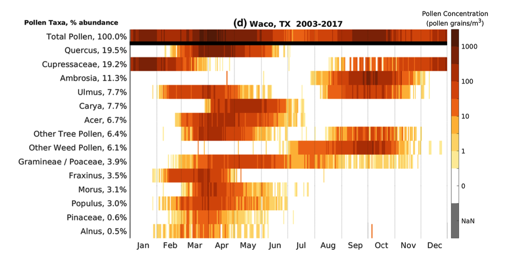

# Bayesian Statistics

Course [home page](./)

See also: [Daily Schedule Term 2](./daily_schedule_term_2.html)

## Daily Schedule Term 3

### Week 8 &mdash; Building Your Intuition &mdash; Hamilton vs. Madison &mdash; The Birthday and Mudslide Problems

* Tuesday, Oct. 29 &mdash; Study Chapter 5 of *Bayesian Statistics for Beginners* &mdash; Do the [Assignment for Tuesday](./assignments/AssignmentFor2024-10-29.nb.pdf)
* Friday, Nov. 1 &mdash; Study Chapter 6 of *Bayesian Statistics for Beginners* &mdash; Do the [Assignment for Friday](./assignments/AssignmentFor2024-11-01.nb.pdf)

