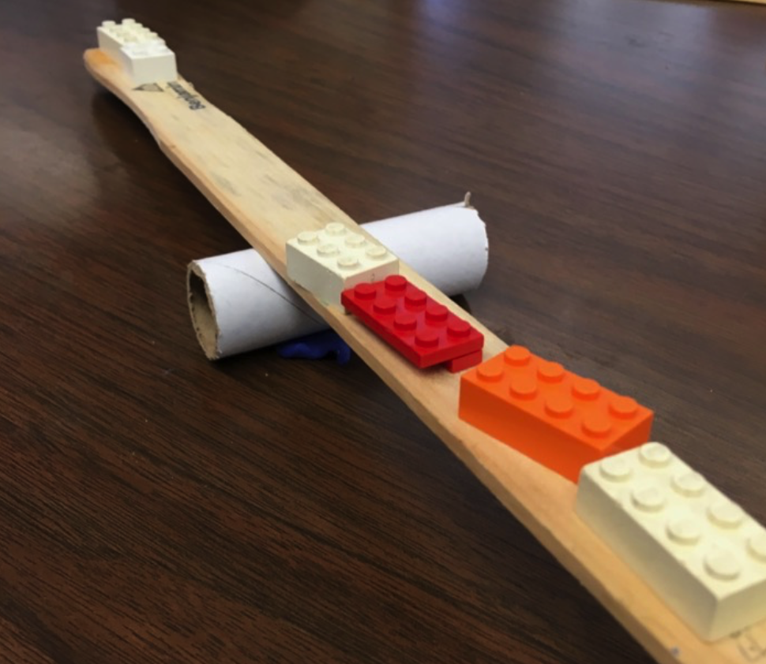

# Bayesian Statistics

Course [home page](./)

See also: [Daily Schedule Term 2](./daily_schedule_term_2.html)

## Daily Schedule Term 3

### Week 8 &mdash; Building Your Intuition with More Examples with Mutually-Exclusive Hypotheses: Hamilton vs. Madison and a Mudslide with Pollen

* Tuesday, Oct. 29 &mdash; Study Chapter 5 of *Bayesian Statistics for Beginners* &mdash; Do the [Assignment for Tuesday](./assignments/AssignmentFor2024-10-29.nb.pdf) &mdash; Preparatory discussion for Chapter 6
* Friday, Nov. 1 &mdash; Study Chapter 6 of *Bayesian Statistics for Beginners* &mdash; Do the [Assignment for Friday](./assignments/AssignmentFor2024-11-01.nb.pdf) &mdash; Preparatory discussion for Chapters 8 and 9: [A Continuum of Hypotheses](./resources/AContinuumOfHypotheses.pdf) &mdash; NOTE: We skipped Chapter 7 because it introduced too little that is new

### Week 9 &mdash; Bayesian Statistics with Probability Distributions

* Tuesday, Nov. 5 &mdash; Dive in at the last half of Chapter 8, pp. 95-107 (if you also try to read pp. 88-94 of Chapter 8, I think you will find it to be a mind-numbing review of what we covered in Young) &mdash; Continue in Chapter 9, pp. 108-122 (this is yet more review of Young but in this case the review is useful) &mdash; Do the [Assignment for Tuesday](./assignments/AssignmentFor2024-11-05.nb.pdf) &mdash; We reviewed Bernoulli and Binomial Distributions, including the &ldquo;*n* choose *k*&rdquo; prefactor in the binomial distribution &mdash; We looked at the etymologty of the terms &ldquo;probability mass function (PMF)&rdquo; (an example of which is the Poisson distribution) as Donovan and Mickey use the term in Chapter 8, and &ldquo;probability density function (PDF)&rdquo; (an example of which is the Gaussian distribution) as Donovan and Mickey use the term in Chapter 9 &mdash; We started the [Assignment for Friday](./assignments/AssignmentFor2024-11-08.nb.pdf)
* Friday, Nov. 8 &mdash; Finish Chapter 9 and the [Assignment for Friday](./assignments/AssignmentFor2024-11-08.nb.pdf) &mdash; We are not starting any new material &mdash; Instead, let's consolidate &mdash; One thing I would like to do is go back to the mug breakage problem and handle the exact same three weeks of data in a different way &mdash; People asked for additional practice problems, which I will provide

### Week 10 &mdash; Exam 2 &mdash; Bayesian Conjugates

* Tuesday, Nov. 12 Exam 2 on Frequentist and Bayesian Statistics which covers:
	* Problem Sets 6 to 12
	* Frequentist statistics:
	    * Application of the linear regression formula and goodness of fit (also known as &chi;-squared)
	* Donovan and Mickey Chapters 1 to 6, and Chapters 8 and 9 on Bayesian Statistics:
		* Bayesian statistics with priors and a finite number of mutually-exclusive hypotheses
		* Bayesian statistics with priors and probability mass functions
		* Bayesian statistics with priors and probability density functions
* Friday, Nov. 15 &mdash; Start Chapter 10 &mdash; Bayesian Conjugates

### Week 11 &mdash;

* Tuesday, Nov. 19 &mdash;
* Friday, Nov. 22 &mdash;

### Week 12 &mdash;

* Tuesday, Nov. 26 &mdash;
* Friday, Nov. 29 &mdash; No class - Shakespeare Festival

### Week 13 &mdash;

* Tuesday, Dec. 3 &mdash;
* Friday, Dec. 6 &mdash;

### Week 14 &mdash;

* Tuesday, Dec. 10 &mdash;
* Friday, Dec. 13 &mdash; Exam 3

### Week 15 &mdash;

* Tuesday, Dec. 17 &mdash;

